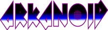
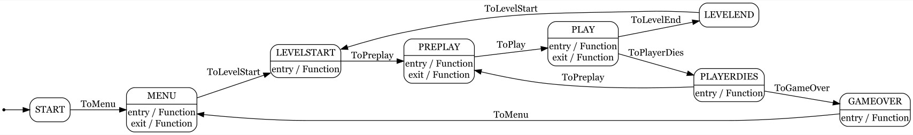

  

Arkanoid plus linear algebra!
============

tl;dr:

This is a project built to try the idea of adding better math calculations to Arkanoid. I have been a fan of the game for a long time, but seemed like the game could see some mild modernization and I was curious as to how proper linear would affect gameplay, so there!
Of course once started some other things came along so I moved all relevant game logic to run through Stateles (a very industry-standard Finite State Machine).
The game has been built from scratch with a few ideas in mind, some of them about the gameplay bit being affected by linear algebra and some of them about structuring the code decently, separating the program in between a drawing block and a math engine that "runs" the world simulation. For instance the ball was a point that could move at any speed and the bricks had all their collsion mesh (a bunch of segments), the same segments, with flipped normals build the walls to the level itself.

Originally it was a fairly pure point/line collision system, but once I added thickness to the ball it would become a segment-group-to-capsule (a time projected sphere) collision and it didn't seem worth it to complicate that much. At small steps a simple segment/sphere collision produces good resutls (a bit like in a fine Euler integration)

---
## Features at a glance

* Written in C# with Monogame as framework,
* Gameplay mechanics coordinated by FSM
* A healthy mix of tasks and async processes.
* Text-based level design, it is easy to iterate and try ideas
* Purely math-based collision and responses. Proper linear algegra through and through (with normals, reflection calculations and so on)

  

---
## FSM Gameplay

It was supposed to be a very small test of math and gameplay but, step by step it evolved into a more fully featured game, with levels, animations, sound and music and the rest. At some point the gameplay became too messy to handle with ifs.

And then, of course, Finite State Machines to the rescue!

I chose C#'s Stateless because it is well documented, very standard and has neat features, like being able to create a dotviz file of the logic that can be made into a graph!

  

## Linear algebra approach

The first implementation was point-based. A moving point, for continuous collisions becomes a line, which is then collided with the segments that make the rest of the scenery, including bricks, enemies and the world walls themselves.
Eventually the ball had to acquire volume and thus the point-to-line approach didn work any more. Moving to a sphere would result in capsule/line collisions which are not that simple (though mathematically interesting) and besides the point for this test. I decided to go for small-step sphere/line discrete collision, which with small enough steps result in indistinguishable results from the gameplay viewpoint.

        
   

You can see the segment collections being visible in this shot, or in this [video](https://www.youtube.com/watch?v=zr9vkhosWPQ). Or gameplay in these others videos: [video 1](https://youtu.be/OPIY_8-ykes), [video 2](https://youtu.be/ajtXl6vqBP8), [video 3](https://youtu.be/IcN0PoVV7M0).

---

## How to install

Of course you'll need to clone the repo, but doing so I'd recommend you to 

1. Install the relevant monogame [version](https://docs.monogame.net/articles/getting_started/index.html)
2. Install [stateless](https://www.nuget.org/packages/stateless)

And then use these steps to clone from SourceTree. Cloning allows you to work on your files locally. If you don't yet have SourceTree, [download and install first](https://www.sourcetreeapp.com/). If you prefer to clone from the command line, see [Clone a repository](https://confluence.atlassian.com/x/4whODQ).

1. You’ll see the clone button under the **Source** heading. Click that button.
2. Now click **Check out in SourceTree**. You may need to create a SourceTree account or log in.
3. When you see the **Clone New** dialog in SourceTree, update the destination path and name if you’d like to and then click **Clone**.
4. Open the directory you just created to see your repository’s files.
5. Once the code has been cloned on your computer you need to install the two fonts contained in the local folder \Arkanoid\Content\Original_content\Fonts_to_install .

---
